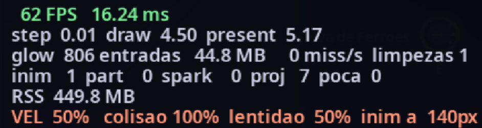
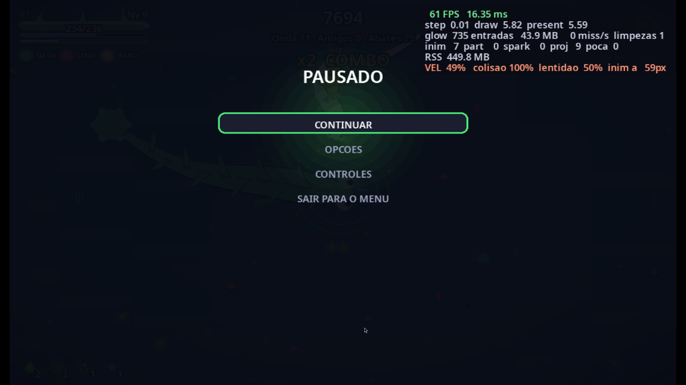

# CURRENT_PLAN — Lagarto

Plano tangível e editável. Marque `[x]` quando pronto. O raciocínio longo mora em
`~/.claude/plans/analise-o-repositorio-do-swift-gem.md`; **este** é a fonte da verdade do
que falta. Atualizado a cada commit.

## Ordem
`B1 bugs → B2 balanço → B3 barras bio → B4 criaturas → 4c acampamento físico → 5/6 chefes → M música → 7 arte`

Regra: paro sempre numa fronteira jogável; `--smoke` verde antes de cada commit.

---

## Feito
- [x] Fase 1 — texto, TopStack, dano por onda, dash/rabada com might
- [x] Fase 2 — 4 inimigos por hábito + campeões (`d8f4344`)
- [x] Fase 3 — 4 personagens + rebuild_body + seleção viva (`5ec49c5` `07902cd` `9037b31`)
- [x] Fase 4 itens — ativos, passivos, qualidade/pools, 12 sinergias, Synergy Factor, ícones (`89c61a1` `26bb438`)
- [x] Playtest — colisão só por inimigo, ferrão, F3 velocidade (`44e709c` `ea8b5c2` `f9b1cdc`)

---

## Fase B1: bugfixes — FEITO (commit pendente)
- [x] Som de menu no teclado
- [x] Seleção de personagem por controle (stick L/R) + limpar pendente ao cancelar
- [x] Abrir/fechar pausa com o controle (botão **Start** — antes só ESC de teclado)
- [x] 6 itens mortos ligados, cada um testado pelo **efeito**:
  Farpas (piercing), Arremesso, Sanguessuga, Contragolpe, Espiral, Ímã (coletáveis)
- [x] Fim de run volta ao menu (ESC / B); ENTER / A reinicia

## Fase B2: balanço — FEITO (commit pendente)
- [x] Rabada — hitbox = 3 juntas da ponta (era metade do corpo) + reach 1.6→1.05; clava 2.6→2.3. Medido: 7/12 → 2-3 alvos por golpe
- [x] Regen — `+4/s` → `+2.2/s` por carta
- [x] Abate dá energia — `+4` ao jogador mais próximo (KILL_ENERGY), coop-safe

## Fase B3: barras bio — FEITO (commit pendente)
- [x] `_bio_bar`: membrana arredondada, menisco pulsante na ponta, brilho interno, flagelos que balançam (só na vida). Sem Surface por frame; 0,23 ms p/ o HUD de 2 jogadores.

## Fase B4: novas criaturas procedurais — FEITO (commit pendente)
- [x] `genome.plan` (declarado no `__slots__`) — fork de corpo, ao lado do `radial`
- [x] **CENTOPEIA** (`plan='segmented'`): cadeia de aneis + marcha metacronal de patinhas.
      Mecânica **cavadora** (`behavior='burrow'`, Para-Bite do Isaac): superfície →
      **telegrafo de mergulho** (cava um buraco, afunda) → intangível por baixo (mound +
      **anel de erupção** no chão + trilha de terra) → aflora e estoura. Pune acampar/andar reto.
- [x] **POLVO / KRAKEN** (`plan='tentacle'`): manto pulsante + braços **contínuos** (mesma
      técnica de contorno da espinha, tapered), que ondulam e chicoteiam. Mecânica
      **agarradora** (`behavior='grapple'`, Gripmaster do Gungeon): fecha, enraíza, **estica
      os braços** (telegrafo >27f), e no estalo te **puxa + retarda**. Pune kitar de perto.
- [x] Entram nas ondas (`species.py` + THEMES `tanques`/`aranhas`/nova `toca`)
- [x] **Modificador DIVISOR** (Blobulon/Fistula): racha em 2 cópias menores ao morrer.
      Fila diferida (`game.spawn_enemy`) p/ não mutar a lista durante o laço que o mata.
- [x] Bodies prontos p/ virar **chefes** na Fase 5/6 (KRAKEN em escala ~2.2x já renderiza)
- [x] Testado: `--smoke 500` verde; teste dirigido (todos os estados disparam, sem crash);
      screenshots dos 3 telegrafos (dig / underground / grab)

## Fase 4c: acampamento físico — FEITO (commit pendente)
- [x] Clareira andável (estado `camp`, `camp['mode']` = `field`/`shop`): tenda + 3 portas
      posicionadas em volta de onde a onda foi limpa. `_step_camp` move os jogadores em
      `field`; `_draw_camp_pois` desenha tenda/portas no mundo.
- [x] **Encostar na barraca** abre a loja (mesmo menu de antes, agora só loja+charms);
      **atravessar uma porta** chama `_apply_route` e avança (portas = rotas, no mundo).
- [x] Loja é **escolha, não pedágio** — dá pra ir direto na porta. `reopen_cd` evita reabrir
      no mesmo passo; fechar a loja só trava com compra em absorção (`pick`), não no drop-in.
- [x] Reusa `ctrl.poll`/`cam.follow` (já rodam todo frame) — movimento no `field` é só chamar
      `player.update`. Teclado/gamepad/mouse do menu **só no modo shop**; ESC/B fecha a loja.
- [x] Testado ponta a ponta (entra → anda → toca tenda → loja → fecha → cruza porta → play);
      `--smoke 400` verde; screenshots da clareira e da loja.

## Fase 5/6: chefes
- [x] Framework FSM (`lagarto/boss.py`): intro → [approach→windup→attack→recover]×N →
      transição (invuln) → próxima fase (troca no máx. 2 coisas: padrões + 1 cooldown).
      Padrões (`radial`/`fan`/`barrage`/`summon`) são dados — `(boss, game, target)->None`.
      Telegrafo desenhado (anel/linha/cone) antes de todo disparo. Testado ponta a ponta:
      intro invulnerável → vulnerável → windup com telegrafo visível (screenshot) →
      recover; corte de HP força transição + invulnerabilidade; morte normal via `die()`.
      *Achado no teste: `nearest_player` devolve `None` se o jogador cai e não há quem
      reviva — `boss_ai.tick` só roda com alvo, então o "bug" de fase não avançar era o
      jogador do teste ter morrido de boba, não o framework.*
- [ ] 10 chefes + PRIMORDIAL final (alguns usam os corpos da B4)

## Overhaul: animação procedural + chefes (`plans/01,02,03_*.md`)
Pedido do usuário: 3 guias novos em `plans/` — 01 eleva a animação procedural
(referência Rain World), 02 reescreve o framework de chefes (mood/personalidade,
telegraph modularizado, arena design), 03 são os 10 chefes + PRIMORDIAL de conteúdo.
Ordem pedida: 01 → 02 → 03. Escopo grande, várias sessões — commits por fronteira.

**Nota de arquitetura (01 §4, Ground Adaptation):** o jogo é top-down flat, sem
campo de altura (`world.py` não tem `ground_y_at`/elevação) — a técnica de
raycast-de-pé-no-chão do doc pressupõe câmera lateral (é como Rain World roda).
Não se aplica aqui; pulada sem substituto, não é regressão.

### Fase A — bugs reportados no overshoot da cauda (corrigidos)
Playtest: cauda esticando MUITO ao mover + streaks gigantes no menu. Duas causas:
- [x] **`menu.py` reimplementa `Lizard.integrate()` em 3 lugares** (`_step_backdrop`,
      `_preview_step`, `_char_preview_step` — armadilha "dois call sites" de novo,
      agora em 3) e nenhum atualizava `tail_spring`: a mola ficava CONGELADA na
      posição de construção enquanto o corpo perambulava pela tela toda, e o
      "overshoot" virava um rastro fixo do tamanho da tela. Corrigido: as 3
      funções agora atualizam `tail_spring.target`/`update(dt)` igual ao
      `integrate()`; `_make_backdrop` também resincroniza a mola após
      reposicionar (senão o 1º frame já nasce esticado).
- [x] **Mola sem teto**: o lag de regime de um spring-damper escala linear com a
      velocidade do alvo (`lag_regime = damping*v/stiffness`) — a 672 px/s do
      dash isso já dava ~50px, mais que o próprio `max_r`. `TAIL_SPRING_MAX_LAG`
      (0.45 × `max_r`) limita o deslocamento cosmético não importa a
      velocidade/teleporte, corrigindo os dois bugs de uma vez (o cap sozinho já
      teria evitado o streak do menu, mesmo sem synca-la).
- [x] **Rabada quebrada**: `_whip_arc` sobrescreve as MESMAS juntas da cauda que
      o `_cosmetic_joints()` desenha, e roda DEPOIS do `integrate()` no mesmo
      frame — a mola (perseguindo a posição pré-golpe) brigava com o arco
      desenhado à mão, embotando/distorcendo o golpe visível. `_cosmetic_joints`
      agora se desliga inteiro enquanto `whip_t > 0` (a rabada já é uma animação
      autoral; a mola não deve competir com ela).
- [x] Verificado: `--smoke 400` verde, screenshot do menu (sem streak),
      screenshot da rabada (arco liso de novo), `test_boss.py`/`test_king.py`
      ainda passam.

### Fase A (01 §3,7,8 parcial) — springs, damping/weight por genoma
- [x] `lagarto/anim.py` novo: `SpringDamper`, `Vector2Spring`, `PhaseOscillator`,
      `Anticipation` — genéricos, sem depender de `Lizard`/`Genome`.
- [x] `Genome.angular_damping/linear_damping/weight` (default 0/0/1.0 = comportamento
      antigo bit-a-bit; só quem opta muda). Aplicado em `Lizard.steer` (giro) e
      `integrate` (drag extra + squash escalado por peso).
- [x] Dials aplicados: tank (0.6/0.5/2.5), spider (0.15/0.2/0.8), octopus
      (0.7/0.6/3.0) — tabela do doc. Boss (`rounds._spawn_boss`) força mínimo
      0.5/0.4/3.0 (linha "Chefe") sem nunca deixar mais leve que a espécie base.
- [x] Cauda com overshoot: 1 `Vector2Spring` por lagarto (`plan='normal'`) persegue
      a ponta física da espinha; só os últimos `TAIL_SPRING_JOINTS` juntas de
      DESENHO (não a física real) são deslocadas rumo à mola — hit-test/pernas/
      olhos continuam lendo `spine.joints` exato, sem risco de desalinhar hitbox.
      `parts.draw_tail` (clava/ferrão) usa a mesma junta cosmética p/ não destacar.
- [x] Verificado: `--smoke 400` verde, teste dirigido tank/spider/octopus 180
      frames sem NaN, `test_boss.py` ainda passa com os dials de chefe.

### Fase B (01 §5,6 — feito)
- [x] **Onda viajante na cauda** (§5 — só faltava esta; espinhos/nadadeiras/chifres
      já tinham fase-offset): ripple lateral por índice de junta, somado por
      cima do overshoot no MESMO `_cosmetic_joints()` (draw-only, cap próprio
      pequeno — não reabre o bug de esticar).
- [x] **Spline Catmull-Rom** (§6/7): `Spine.outline_smooth`/`body_polygon_smooth`
      (`SMOOTH_SUBDIV=3`) suaviza a silhueta do corpo `plan='normal'` sem mover
      as juntas físicas (hit-test/pernas/olhos continuam exatos). Custo medido:
      +0,17ms em 13 inimigos (~0,013ms/criatura) — ruído, não regressão.
- [ ] Ground Adaptation (§4) — **decisão de arquitetura, não pendência**: jogo é
      top-down flat, sem campo de altura; ver nota acima.

### Fase C (01 §3,11 — feito, versão enxuta)
- [x] **Spring-damper real em chifres** (§3, tabela cita stiffness=16/damping=0.85
      — usado ao pé da letra): `head_dir_spring` (`Vector2Spring`) persegue a
      direção da cabeça; a defasagem vira "lean" em `draw_horns` — chifre
      atrasa de verdade numa curva rápida, não é mais só seno de idle.
      **Um terceiro call site já apareceria congelado** (mesma armadilha do
      `tail_spring`) — extraído `Lizard.update_secondary_springs`/
      `reset_secondary_springs`, ponto único que os 3 bypasses do `menu.py` e o
      `integrate()` chamam, em vez de reimplementar de novo.
- [x] **Personalidade emergente (§11), versão grounded**: em vez de um sistema
      de mood genérico sem consumidor, reusa o mood que `BossAI` já calcula —
      `AILizard._apply_mood_pose` escala a `stiffness` de `tail_spring`/
      `head_dir_spring` pelo mood (`BOSS_MOOD_SPRING_MULT`): calm = solto,
      enraged/cornered = tenso/nervoso. Zero desenho novo, mesmas molas reagem
      mais rápido. Testado: chefe encurralado mede stiffness 14.0 (base 10 ×
      1.4), mood 'cornered' correto.
- [ ] **"Dois esqueletos" genérico (§10), full `CosmeticSkeleton`** — decisão:
      NÃO construído como classe própria. Tentáculo/centopeia já resolveram o
      problema de corpo contínuo do jeito deles (`_arm_polygon`/segmentos);
      tail_spring+head_dir_spring já são, na prática, uma camada cosmética
      separada da simulação para os dois casos que existem hoje. Sem um 3º
      consumidor concreto, uma classe genérica é infra sem chamador — YAGNI.
      Revisitar se/quando um chefe pedir uma cosmética própria mais rica
      (ANKH "dissolve em partículas" é candidato natural).
- [ ] `anim.SpringDamper`/`PhaseOscillator`/`Anticipation` (1D genéricos) —
      ainda SEM uso (só `Vector2Spring` está em produção). Não removidos ainda
      porque `Anticipation` tem candidato óbvio (wind-up de `_ai_lunge`/
      `_ai_ranged`, hoje cada um com seu próprio decremento manual de timer) —
      mas não forçado neste commit para não crescer o escopo sem necessidade.

### Fase 02: BossAI 2.0 (parcial)
- [x] Mood system (`calm/agitated/enraged/frustrated/cornered`, `BossAI._update_mood`)
      + `BossPersonality` (mood_speed, pattern weight por mood, glow por mood,
      tell mais curto quando agitado/enraged). `_choose_pattern` agora pesa por
      personalidade+mood em vez de `random.choice` puro.
- [x] 3 padrões novos no catálogo: `shockwave` (AoE instantâneo, telegrafo=anel
      no chão), `spiral` (tick por frame tipo `_tick_barrage`, gira
      `BOSS_SPIRAL_TURN`°/tiro), `charge` — este exige um estado **novo** na FSM
      (`'charging'`): windup → dispara `_charge_dir` → N segundos de movimento
      real na direção (não instantâneo), com dano de contato via `_contact`
      (bosses antes não causavam dano por toque nenhum, só projétil).
- [x] `BossAI.__init__` ganhou `name`/`personality`/`on_phase` opcionais —
      compatível com o construtor antigo (`rounds.py` genérico continua igual).
- [ ] Telegraph modularizado em arquivo próprio (`boss_telegraph.py`) — adiado,
      o `draw()` ainda mora em `boss.py`; puramente uma reorganização, sem
      urgência funcional.
- [ ] Padrões restantes do catálogo (laser_sweep/bounce/minefield/gravity_well/
      teleport_strike) — implementar sob demanda, conforme os próximos chefes
      da Fase 03 precisarem (evita código especulativo sem chefe que o use).
- [ ] Arena design (pilares/corredor/poças) por chefe — ainda não precisou
      (Rei Lagarto usa clareira aberta); entra quando um chefe pedir (Muralha).

### Fase 03: 10 chefes + PRIMORDIAL (4/11 prontos — arco do modo NORMAL completo)

**Remapeamento de onda (decisão, não desvio silencioso):** o doc 03 dá cada chefe
uma onda narrativa (5,7,8,9...), mas o motor só sorteia chefe a cada `BOSS_EVERY`
(5) ondas — só 5/10/15/20(final)/25/30... existem de verdade. Mapeado para os
tiers reais: **tier1=onda5 Rei Lagarto, tier2=onda10 Centopeiadeira, tier3=onda15
próximo, is_final=onda20 Primordial**, resto (Terror Alado, Mãe-Escaravelho,
Kraken-Mor, Aranha-Rei, Olho-Sísmico, Serpente Cristal, Muralha, ANKH) viram
tiers 5+ (só modo infinito, onda 25+) — dá um lugar real pra todos sem mudar a
cadência do jogo.

- [x] **REI LAGARTO** (tier1/onda5, corpo=`horned` 2.3x, hue verde + chifres/
      espinhos/clava): fase 1 `fan+shockwave+charge`, fase 2 (66%) soma `radial`,
      fase 3 (33%) troca `fan`→`spiral` + cd 0.7x. Personalidade favorece `charge`
      quando cornered/enraged. **Cicatriz**: a cada 25% de HP perdido nasce uma
      `weapons.Puddle` (ganhou `slow=` opcional) que some na transição de fase.
- [x] **CENTOPEIADEIRA** (tier2/onda10, corpo=`centipede` 2.3x): fase 1
      `burrow+spiral+pincha`, fase 2 (60%) soma `radial`, fase 3 (30%) troca
      `burrow`→`deathroll` (spiral bem mais denso/rápido, MESMA função
      `spiral_pattern` com dials diferentes no dict — nada duplicado).
      **Burrow reaproveitado por inteiro**: novo estado de FSM `'burrowing'`
      delega todo frame pro `AILizard._ai_burrow` já existente (dig/erupt/
      telegrafo do centipede comum) em vez de reescrever — `AILizard.draw()`
      já desenha o buraco/monte sem `boss.py` saber disso. **Degradação**:
      `on_phase` encolhe `genome.length` + acelera `genome.speed` e chama
      `rebuild_body(keep_pose=True)` a cada transição — corpo visivelmente
      menor e mais rápido, menos hitbox. Novo padrão `pincha` (mordida curta,
      windup 0.3s). Testado: burrow real (foto), encolhe 60→53 juntas +
      acelera 1.11→1.39 no corte de fase, morte.
- [x] **KRAKEN-MOR** (tier3/onda15, corpo=`octopus` 2.3x): fase 1
      `grapple+fan+swipe`, fase 2 (66%) soma `arms_rain`, fase 3 (33%) troca
      `fan`→`spiral` + cd 0.75x. **Grapple reaproveitado por inteiro** (mesmo
      truque do burrow): novo estado `'grappling'` delega pro
      `AILizard._ai_grapple` já existente — braços convergindo (`arm_target`)
      é o telegrafo de graça. Novo padrão `swipe` (mesma função `pincha_bite`
      do centopeia, só com alcance/dano maiores via dict — zero código novo).
      Novo padrão genérico `arms_rain` (2-3 pontos marcados perto do alvo,
      crescem no chão, estouram) — introduziu o hook `select` no FSM (chamado
      na ESCOLHA do padrão, não no fim do windup) porque os pontos precisam
      existir durante todo o telegrafo, não só na hora de bater; reusável por
      qualquer chefe futuro com ataque de área em múltiplos pontos (Mãe-
      Escaravelho/Primordial). Personalidade: prefere fechar com grapple
      quando calmo, só fica frenética (arms_rain/spiral) com raiva. Testado:
      braços convergindo (foto), pontos de arms_rain no chão (foto), fase 2,
      morte — mais os 3 testes anteriores continuam verdes (spiral_pattern e
      pincha_bite viraram compartilhados nesta rodada).
- [x] **PRIMORDIAL** (is_final/onda20, corpo=`horned` ~3.1x — 2.3x padrão de
      chefe × 1.35x já existente pro chefe final; "4x" do doc é só flavor
      text, reusei a convenção já existente em vez de inventar outro número):
      `plates+spikes+horns+tail=club+wings+extra_eyes` — todas as partes do
      jogo ao mesmo tempo, como o doc pede, via genoma só. Fase 1
      `massive_fan+shockwave` (fan_shot generalizado pra ler count/spread/
      dano do dict — `massive_fan` reusa a mesma função com 12 tiros/70°/
      dano maior). Fase 2 (66%) soma `sky_slam`+`summon` (2 padrões — chefe
      final ganha a mesma licença de quebrar a "regra dos 2" que o doc dá pra
      ANKH, registrado aqui, não por acidente). Fase 3 (33%) soma `deathroll`
      + cd 0.5x ("Apocalypse"/"Rage"). **`sky_slam`** é novo: reusa
      `_select_arms_rain`/`arms_rain` com `count=1,spread=0` (1 ponto colado
      no alvo = sombra gigante, não cluster) e ADICIONALMENTE deixa uma
      `weapons.Puddle` de magma onde caiu — "Sky Slam" e "Magma Spit" do doc
      viraram 1 ataque só em vez de dois. Personalidade quase neutra até a
      fase 3 (raiva pesa mais aí), matching "só nota você quando é tarde".
      Registrado em `rounds.NAMED_BOSSES['final']` (chave especial, não
      tier) — `_spawn_boss` já tinha um branch `is_final` separado do tier;
      virou só mais uma entrada `named`, sem duplicar a lógica de
      overrides/scar/on_phase que as outras 3 já usam.
      Testado: `wings`/`plates`/`extra_eyes` no genoma, as 3 fases + patterns
      de cada uma, sky_slam com foto do banner "PRIMORDIAL"+barra grande,
      morte. **Nota de confiabilidade**: os testes dirigidos deste chefe (e
      dos outros 3) rodam ~3000-6000 frames sem seed fixa de `random` —
      ocasionalmente uma sequência de sorteio falha em escolher um padrão
      específico dentro da janela do teste (estatística, não bug: verificado
      via trace detalhado que burrow/grapple/fases funcionam certo quando
      observados com granularidade fina). Scripts de teste ficam no
      scratchpad, não são parte do repo.
- [ ] Tiers sem chefe autoral em `NAMED_BOSSES` caem no chefe genérico antigo
      (aleatório do tema) — não regride, só ainda não tem conteúdo autoral.
- [ ] Próximos (só modo infinito, onda 25+): Terror Alado, Mãe-Escaravelho,
      Aranha-Rei, Olho-Sísmico, Serpente Cristal, Muralha (precisa de sistema
      de arena/confinamento que ainda não existe — mundo é aberto contínuo,
      sem salas discretas), ANKH
- [ ] Corpos novos que faltam: `winged` (Terror Alado), `orbital` (Olho-
      Sísmico), `wall` (Muralha) — crystal reusa `segmented` com estética nova
- [ ] Gerar pixel art só se necessário no caminho (ícones novos, não sprites do bicho)

### Sistema de pool de chefes (Isaac-style) — feito
Pedido do usuário: em vez de 1 chefe fixo por onda, cada "andar" tem um POOL de
chefes possíveis, sorteado por run (igual Isaac: cada bioma tem 2 chefes
candidatos). Refatorado `rounds.NAMED_BOSSES` (tier→1 chefe) para
`rounds.BOSS_POOL` (id→dados, chefe-agnóstico de onda) + `BOSS_TIER_POOLS`
(lista de `(range de tiers, [ids elegíveis])`) + `_boss_pool_for_tier(tier)`.
`_spawn_boss` sorteia `random.choice(pool_ids)` em vez de indexar por tier.
- `BOSS_TIER_POOLS = [(range(1,4), ['rei_lagarto','centopeiadeira','kraken_mor'])]`
  — onda 5/10/15 do modo normal agora sorteiam entre os 3, variando a cada run.
- `BOSS_FINAL = 'primordial'` fica FORA do sorteio (`is_final` sempre usa ele
  direto) — é o clímax fixo da run, não faz sentido ser aleatório.
- Tiers sem pool (5+, só infinito) continuam caindo no chefe genérico de
  sempre até ganharem entradas — próximos chefes entram nesse `BOSS_TIER_POOLS`
  conforme forem escritos, não precisa esperar todos prontos.
- Testado: 60 rolls na onda 5 → distribuição ~1/3 pra cada um dos 3 (19/20/21),
  final sempre PRIMORDIAL, `--smoke` verde.

### Doc 04 (mapeamento) — Anticipation aplicada (parcial, versão segura)
Doc 04 pede `Anticipation` em dash/rabada/língua/IA. **Decisão**: não adicionar
latência de input ao JOGADOR (dash/rabada/língua já disparam na borda do botão
de propósito — é o sistema de input buffer documentado no CLAUDE.md; atrasar
a ação do jogador pra "mostrar anticipation" pioraria o feel, não é isso que
o doc quer dizer pra controles responsivos). Aplicado só onde já existe uma
janela de espera (telegrafo) sem mudar QUANDO o ataque dispara — só como ele
é visto chegando:
- [x] `Lizard.squat_bias` novo (default 1.0): multiplica o ALVO do squash em
      `integrate()` (que já existia, só por velocidade) e decai sozinho de
      volta a 1.0 se ninguém mexer — quem quiser um agachamento antes de agir
      só seta o valor todo frame da própria janela de espera JÁ existente, sem
      brigar com o squash por velocidade (mesma lição do `tail_spring`: um
      hook central, não reimplementação por chamador).
- [x] Aplicado em 3 IAs que já tinham timer de espera mas nenhum squash:
      `_ai_ranged` (agacha durante `shoot_charge`), `_ai_lunge` (agacha durante
      `lunge_t`, explode ao saltar), `_hop` do sapo (agacha nos 0.15s antes do
      salto, pop ao decolar).
- [x] Chefes: `BossAI` seta `squat_bias` durante `'windup'` (qualquer padrão) e
      solta ao disparar — telegrafo de TODO chefe ganha o mesmo "se encolhendo
      pra atacar" de graça, sem tocar em nenhum boss individual.
- [ ] `_ai_melee` continua sem wind-up — doc pede, mas mudaria o timing real do
      dano de contato de TODOS os inimigos base (runner/tank/snake/etc.), um
      rebalanceamento de fato, não só visual; não fiz sem pedido explícito.
- [ ] Pose por estado de IA (caçando agachado/fugindo baixo/agressivo arqueado)
      — não feito, é um sistema novo de verdade, não uma reutilização de timer
      existente como os itens acima.

## Fase M: música adaptativa
- [ ] Stems por intensidade via `/music-generator`; mixar ao vivo por vida/inimigos/combo/chefe
- [ ] Carregar se existir, senão fallback synth numpy (headless/CI verdes)

## Fase 7: arte PNG (EM ANDAMENTO — geração de assets)
Pedido do usuario: gerar assets com o skill /pixel-art-gen. Icones 16/32, coisas
detalhadas (loja do besouro etc.) em 64/80. Mais organico, curvas, AA.
- [x] Ferramenta de autoria `pxgen.py` (scratchpad): shapes como mascaras de cobertura
      (supersample) + pintura de volume rampa-4 (highlight/base/shade/edge) + AA manual
      na borda + contorno **sel-out** (tom escuro do fill, nao preto). Emite JSON do skill
      e chama `render_pixel_art.py`. Guia: Pixel Parmesan / Lospec / Pixnote.
- [x] Lote 2 (32x32 + 80, `c026b55`): coin_pollen, health, cuspe, tent_beetle.
- [x] Lote 3 (32x32, `c026b55`): 7 armas restantes (ferrao teia esporos feromonio
      sopro enxame acido) — as 8 armas de `icons.py` completas.
- [x] Lote 4 (32x32, `6eb237a`): 8 icones de mutacao-stat que **colidem de forma**
      no `icons.py` (`_bolt`: speed/energy/might; `_arrow`: dash/ferrao) — speed
      energy might xp area haste amount dash. Refinamento em `batch4b.py`
      (might/dash reprovados na 1a passada, redesenhados: punho com sulcos, pata
      com 3 dedos+almofada+trilha).
- [x] Lote 5 (24x24, `1147304`): pickups — pickup_fruit pickup_egg pickup_bug.
- [x] Lote 6 (32x32, `1e656c6`): 9 de 10 charms — antenas presas olhos carapaca
      espinhos asas glandula nectar clava. `glandula`/`nectar` tambem colidiam
      (`_sac`); saem distintos (cacho verde vs gota ambar).
      **Charm `ferrao` pulado de proposito**: usa o MESMO id `'ferrao'` que a arma
      no dict de `icons.py` (dois conceitos, uma chave) — ja existe `ferrao.png`
      pra arma; gerar outro pro charm exigiria separar os ids no codigo primeiro.
      Documentado em `tools/pixelart/README.md`.
- **Total: 31 PNGs** em `assets/icons/` (32x32 armas+stats+charms, 24x24 pickups)
  + `assets/props/` (80x80 tent_beetle). Geradores versionados em `tools/pixelart/`
  (`pxgen.py` = camada de autoria; `batch2..6.py` = lotes; `README.md` documenta).
- [x] **Pipeline ligado** (`755b445`): `lagarto/assets.py` (`resource_path`/`_MEIPASS`,
      lazy, `.convert_alpha()` so apos `display.init`, cache `(id,diametro)` teto 300)
      + `icons.draw` tenta PNG primeiro, cai pro procedural se `None`. Verificado em
      runtime real (screenshot HUD + carta EVOLUIR mostrando `xp.png` de verdade).
      Invariante "zero assets" quebrada de proposito, documentado no CLAUDE.md.
- [x] `build.py --add-data` p/ empacotar `assets/` no executavel PyInstaller (`9b1ba7c`).
- [ ] Nitidez: pre-escala NEAREST por fator inteiro antes do `present()` borrar
      (hoje `smoothscale`; aceito por ora — confirmado visualmente nitido nos
      screenshots reais de HUD/carta, baixa prioridade).
- [ ] `tent_beetle.png` gerado mas **NAO ligado** — `_draw_camp_pois` continua
      procedural (tem a animacao de queda do ceu; integrar o PNG e mais invasivo).
- [ ] Assets restantes possiveis: props do acampamento (portas, ninho), flora/mundo.

Geradores versionados em `tools/pixelart/` (reproduzivel). Build sem `assets/`
continua rodando (fallback procedural cobre qualquer PNG faltando).

### Ajustes pendentes

- [ ] Fazer dificuldade escalar mais rapidamente durante a run.
- [ ] Aumentar progressivamente HP, velocidade, quantidade de inimigos e campeões um pouco mais rapido.
- [ ] Evitar efeito snowball onde jogador deixa de correr risco no meio da partida.

---

### Correções pendentes

- [ ] Investigar lentidão que aparece após crescer alguns níveis. Desta vez não houve queda de FPS, apenas colisões excessivas. Suspeita principal: hitboxes ou broadphase.  
- [ ] Instrumentar sistema de colisão para medir:
  - número de hitboxes
  - testes de colisão por frame
  - tempo gasto em broadphase e narrowphase
- [ ] Verificar se `rebuild_body()` está duplicando segmentos ou colliders.
- [ ] Confirmar que segmentos antigos são removidos corretamente da estrutura de colisão.

### Renderização

- [ ] Tornar outline consistente em todas as partes do corpo.
- [ ] Adicionar outline nas pernas.
- [ ] Adicionar outline na língua.
- [ ] Melhorar continuidade do outline entre segmentos.
- [ ] Aumentar levemente a pixelização da imagem.

### Língua

- [ ] Aumentar espessura da língua.
- [ ] Reescrever animação usando cinemática inversa (IK).
- [ ] Movimento procedural semelhante ao de um camaleão.
- [ ] Alongamento, retração e curvatura mais naturais.
- [ ] Estudar língua do camaleão real.
- [ ] Analisar língua do lagarto de Rain World como referência.

### Evoluções

- [ ] Remover cauda-clava da árvore de evolução.
- [ ] Manter cauda-clava apenas como Charm.

### Assets restantes

- [ ] Pré-escalar usando NEAREST antes de `present()`.
- [ ] Integrar `tent_beetle.png` ao acampamento.
- [ ] Criar props restantes (portas, ninho, flora e elementos do mapa).

---

## Pesquisa — animação procedural

Objetivo: absorver técnicas para elevar qualidade de movimentação de criaturas, chefes e jogador.

### Referências

- [ ] Estudar profundamente:
  - https://www.youtube.com/watch?v=sVntwsrjNe4
  - https://medium.com/@merxon22/recreating-rainworlds-2d-procedural-animation-part-1-4d882f947e9f
  - https://www.youtube.com/watch?v=PcpkBzcRdSU
  - https://youtu.be/wgpgNLEEpeY?si=8YfssF0-jhYjGSkA

### Documentação

- [ ] Anotar técnicas utilizadas.
- [ ] Documentar princípios, vantagens e limitações.
- [ ] Adaptar cada técnica para arquitetura do Lagarto.

### Técnicas para estudar

- [ ] IK (CCD/FABRIK)
- [ ] Follow chains
- [ ] Restrições articulares
- [ ] Secondary motion
- [ ] Phase offsets
- [ ] Damping
- [ ] Procedural posing
- [ ] Spline dinâmica
- [ ] Squash & Stretch
- [ ] Anticipation
- [ ] Weight e overlap
- [ ] Ground adaptation

### Resultado esperado

- [ ] Criar guia interno reutilizável para futuras criaturas, chefes e animações procedurais do projeto.